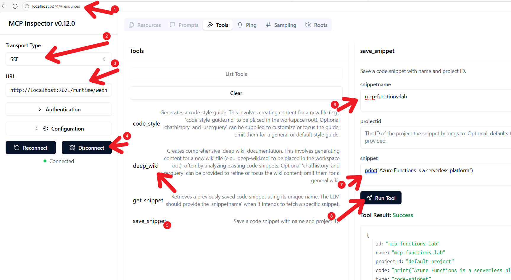

# Build and Deploy AI Agents with MCP and Azure Functions - Hands-On Lab

## Lab Overview

In this hands-on lab, you'll build **Snippy**, an intelligent code snippet manager using Azure Functions. You'll implement features to save and retrieve snippets, storing them in Azure Cosmos DB. Semantic meaning will be captured using Azure OpenAI embeddings, and you'll integrate AI-powered features to automatically generate documentation and coding standards from your snippets.

A key focus of this lab is making Snippy's capabilities accessible in two ways:
- Through standard HTTP APIs 
- As **Tools** consumable by AI agents like GitHub Copilot using the **Model Context Protocol (MCP)**


## Prerequisites

Your lab environment comes pre-configured with:
- **Visual Studio Code** - Primary development environment
- **Edge Browser** - With tabs for GitHub, Azure Portal, and Azure AI Foundry
- Python 3.12
- **uv** package manager (faster alternative to pip)
- Git for source control
- Azure CLI for managing Azure resources
- Azure Functions Core Tools v4 for local function development
- Azure Developer CLI (AZD) for simplified deployment workflows


## Section 1: Lab Setup

### Step 1: Access the Lab Environment

1. Log in to the Windows 11 lab VM with the credentials above
2. From your lab environment's Desktop (or Taskbar), open **Edge - Snippy & Portal** shortcut
3. This opens three important tabs:
   - **Snippy Lab GitHub Repo** (https://aka.ms/functions-mcp-lab)
   - **Azure Portal** (https://portal.azure.com)
   - **Azure AI Foundry** (https://ai.azure.com)

> **Important:** Use the Split Window feature by selecting the hamburger icon in the top right corner and selecting "Split window" for better organization.

### Step 2: Fork the Repository

1. From Edge, in the Snippy tab, select **Fork → Create fork** (this will prompt you to sign in to your GitHub account)
2. **Uncheck** "Copy the main branch only" as we will be working with the **build-2025** branch
   
3. After the fork completes, validate the HTTPS URL of your fork
   - Example: `https://github.com/YOUR-USERNAME/snippy.git`

### Step 3: Clone and Setup the Repository

1. Launch **VS Code** from the Taskbar or desktop shortcut
2. Open a new **Terminal** inside VS Code (*Terminal → New Terminal*)
3. Run the following commands (replace `YOUR-USERNAME` with your GitHub username):

```powershell
# Clone your fork
git clone https://github.com/YOUR-USERNAME/snippy.git
cd snippy

# Check out the main lab branch
git checkout build-2025

# (Optional) Also fetch the bonus branch
git fetch origin durable-functions

# Open the project in VSCode
code . --reuse-window
```

4. If successful, VS Code will open the **snippy** folder with the **build-2025** branch checked out

### Step 4: Configure Infrastructure Files

1. Select **infra > main.bicep** and view line 37
2. Replace line 37 with:
```bicep
var resourcePrefix = 'snippy'
var labInstance = last(split(environmentName, '-'))
var resourceToken = 'snippymcplab${labInstance}'
```

3. View lines 47-51 and replace with:
```bicep
resource rg 'Microsoft.Resources/resourceGroups@2021-04-01' = {
  name: !empty(resourceGroupName) ? resourceGroupName : 'rg-snippymcplab'  
  location: location  
  tags: tags
}
```

4. **File > Save** and close the file

### Step 5: Sign in to GitHub Copilot

1. In VS Code, sign in to **GitHub Copilot** by either:
   - Selecting the Copilot status icon in the bottom-right corner
   - Or press **Ctrl+Shift+P** → type "GitHub Copilot: Sign in"
2. A browser window will open for authorization
3. After authorization, select **Continue** to grant access

> **Note:** If your organization has disabled MCP server functionality, you may not be able to test MCP tools later. Use a personal GitHub account or the MCP Inspector tool as workarounds.

4. (Optional) Open the **Azure** sidebar in VS Code and sign in with the Azure credentials provided above

---

## Section 2: Azure Resource Provisioning

### Step 6: Start Resource Provisioning with AZD

This process runs in the background while you work on coding exercises.

1. **Login to azd** - Open terminal in VS Code (ensure you're in the *snippy* root directory):
```bash
azd auth login
```

2. Use the Azure credentials provided  to sign in


3. **Set up the azd Environment:**
```bash
azd env new snippy-mcp-lab-53214229 --subscription c91a2eda-31b2-4b05-8450-3a18f445f052 --location westus2
```

4. **Provision and Deploy Resources:**
```bash
azd provision
```

> **Important:** Do NOT wait for this to complete. Proceed immediately to the coding exercises while it runs in the background.

**Resources being provisioned:**
- Azure Function App (using Flex Consumption plan)
- Azure Storage Account (for Functions operations)
- Azure Cosmos DB for NoSQL (pre-configured for vector search)
- Azure AI Services (with *gpt-4o* and *text-embedding-3-small* models)
- Azure AI Foundry resources (Project, Hub for AI Agents Service)
- Azure Key Vault (for secrets)
- Azure Log Analytics & Application Insights (for monitoring)

These resources are created within a new resource group named **rg-snippymcplab**. You will deploy your application code to the Function App later using `azd deploy`.

**Proceed to coding exercises while this provisioning takes place.**

Ensure you can easily access the terminal running `azd provision` to monitor its progress and verify when it finishes.

### 5b (Optional fallback) Manual resource provisioning (use only if azd provision fails)

---

## Section 3: Coding Exercises - Implement MCP Tools and AI Agents

**Target File:** Navigate to and open **src/function_app.py** in VS Code

### What You'll Learn

This lab focuses on two key Azure Functions AI integration patterns:

1. **Azure Functions as MCP Tools for AI Agents**
   - Transform functions into discoverable tools for AI agents like GitHub Copilot
   - Use MCP trigger to eliminate custom integration code

2. **Azure Functions Creating AI Agents and Serving as Their Tools**
   - Functions can create and invoke AI agents
   - Bi-directional relationship where agents can also use your functions as tools

In this lab, you'll put both approaches into practice:

**For Approach 1 (Functions as MCP Tools):** You'll enhance the `save_snippet` function by adding an MCP Tool Trigger, making it directly callable by GitHub Copilot and other MCP-aware AI agents.

**For Approach 2 (Functions Orchestrating Agents):** You'll examine the `deep_wiki` function to understand how it creates an AI agent that, in turn, utilizes tools (which can include other Azure Functions) to analyze code snippets and generate documentation.

**Key Azure Technologies You'll Use:**

- **Azure Functions**: The serverless compute backbone for your AI tools and agent interactions.
- **Azure Functions Extensions**:
  - **MCP Tool Trigger** (`@app.generic_trigger`): Exposes your function as a discoverable MCP tool.
  - **Embeddings Input Binding** (`@app.embeddings_input`): Seamlessly generates vector embeddings from input data.
- **Azure Cosmos DB with Vector Search**: Stores code snippets and their embeddings, enabling efficient semantic retrieval.
- **Azure AI Agents Service**: Facilitates the creation and management of specialized AI agents that your functions can invoke.

**Target File:** Navigate to and open `src/function_app.py` in the VS Code editor.

### Exercise 1: Define Tool Properties for save_snippet

**Concept:** Define the schema of inputs your function expects for AI assistant consumption.

1. Locate the *TODO: Lab Exercise 1* comment in **src/function_app.py**
2. Replace the empty list assignment for *tool_properties_save_snippets* with:

```python
# TODO: Lab Exercise 1 - Define the tool properties for save_snippet
# Create a list of ToolProperty objects that define the expected inputs (schema)
# Each property has a name, type, and description for the AI agent
tool_properties_save_snippets = [
    ToolProperty(_SNIPPET_NAME_PROPERTY_NAME, "string", "The unique name for the code snippet."),
    ToolProperty(_PROJECT_ID_PROPERTY_NAME, "string", "The ID of the project the snippet belongs to. Optional, defaults to 'default-project' if not provided."),
    ToolProperty(_SNIPPET_PROPERTY_NAME, "string", "The actual code content of the snippet."),
]
```

> **Knowledge:** This property schema provides natural language descriptions that help the LLM understand what each parameter is for and how to map user requests to specific variables.

### Exercise 2: Making Your Azure Function Available as an MCP Tool

**Concept:** The MCP Tool Trigger transforms your function into a tool that any MCP-compatible AI assistant can discover and use.

1. Locate the *TODO: Lab Exercise 2* comment in **src/function_app.py**
2. Above the *mcp_save_snippet* function, add the following decorator:

```python
# TODO: Lab Exercise 2 - Add the MCP tool trigger binding
# Add the @app.generic_trigger decorator to register this function as an MCP tool
@app.generic_trigger(
    arg_name="context", # Variable name for the incoming MCP data
    type="mcpToolTrigger", # Specify the trigger type
    toolName="save_snippet", # How the agent refers to this tool
    description="Save a code snippet with name and project ID.", # Description for the agent
    toolProperties=tool_properties_save_snippets_json, # The input schema (from Ex 1)
)
```

> **Knowledge:** This decorator registers your function with the MCP server endpoint, creating a fully managed, secure MCP server without additional infrastructure.

### Exercise 3: Enhancing with Azure Functions Bindings

**Concept:** Azure Functions bindings can pre-process data. The Embeddings Input Binding automatically generates vector embeddings from text.

1. Locate the *TODO: Lab Exercise 3* comment
2. Below the MCP trigger decorator (above the function signature), add:

```python
# TODO: Lab Exercise 3 - Add the embeddings input binding
# Add the @app.embeddings_input decorator to enable automatic embedding generation
@app.embeddings_input(
    arg_name="embeddings", 
    input="{arguments." + _SNIPPET_PROPERTY_NAME + "}", 
    input_type="rawText", 
    embeddings_model="%EMBEDDING_MODEL_DEPLOYMENT_NAME%"
)
```

> **Knowledge:** This binding automatically calls Azure OpenAI before your function runs, providing generated embeddings as a parameter and simplifying your function code.

### Exercise 4: Understanding Azure Functions That Call AI Agents (Review)

**Concept:** Azure Functions can create and invoke AI agents for complex tasks.

1. Open **src/agents/deep_wiki.py** and review how this module creates and manages agents
2. Key parts to understand:

**Connecting to AI Project:**
```python
async with AIProjectClient.from_connection_string(
    credential=credential,
    conn_str=os.environ["PROJECT_CONNECTION_STRING"]
) as project_client:
```

**Registering a tool for the agent:**
```python
functions = AsyncFunctionTool(functions=[vector_search.vector_search])
```

**Creating an agent:**
```python
agent = await project_client.agents.create_agent(
    name="DeepWikiAgent",
    description="An agent that generates comprehensive wiki documentation",
    instructions=_DEEP_WIKI_SYSTEM_PROMPT,
    tools=functions.definitions,
    model=os.environ["AGENTS_MODEL_DEPLOYMENT_NAME"]
)
```

**Managing agent execution:**
```python
run = await project_client.agents.create_run(...)

while True:
    # Check run status
    if run.status == "requires_action":
        # Handle tool calls from the agent
        tool_calls = run.required_action.submit_tool_outputs.tool_calls
        for tool_call in tool_calls:
            output = await functions.execute(tool_call)
            # Collect output for submission back to agent
```

> This pattern lets your Azure Function create an agent on demand, provide it with tools, manage its execution, and return the final result - all within a single serverless function invocation.


**Azure Functions Unlock Powerful AI Integration Patterns**

Azure Functions are the ideal platform for building AI-powered tools because they provide:

- **Serverless Compute**: Scale automatically to handle varying loads
- **First-class Support for MCP**: Built-in triggers make functions available as tools
- **Rich Bindings Ecosystem**: Input/output bindings simplify integration with Azure services
- **Language Flexibility**: Support for Python, .NET, JavaScript and more
- **Remote Accessibility**: Functions can be deployed once and shared across multiple agents

For example, here's how an Azure Function can become a tool for an Agent built using AI Agents Service:

```python
# Inside your Azure Function
async def create_analyzer_agent(vector_search_function_url):
    async with AIProjectClient.from_connection_string(...) as client:
        # Create an agent with your Azure Function as a tool
        agent = await client.agents.create_agent(
            name="DeepWikiAgent",
            tools=[{
                "type": "azure_function",
                # 🔑 KEY POINT: This references a remote Azure Function that can be:
                # - Deployed once and used by many agents
                # - Managed independently from agent definitions
                # - Scaled according to demand across all agent users
                # - Secured with proper authentication
                "azure_function": {
                    "function": {
                        "name": "VectorSearchFunction",
                        "description": "Performs semantic vector search on code snippets",
                        "parameters": {
                            "type": "object",
                            "properties": {
                                "searchQuery": {"type": "string", "description": "The search term"},
                                "projectId": {"type": "string"}
                            }
                        }
                    },
                    "url": vector_search_function_url,
                    "api_key": os.environ["FUNCTION_KEY"]
                }
            }]
        )
    return agent
```

### Exercise 5: Understanding Integration Approaches

**Comparison of Azure Functions AI Integration:**

| Aspect | Functions as MCP Tools | Functions Creating Agents |
|--------|----------------------|---------------------------|
| **Key Technology** | Azure Functions with MCP Tool Trigger | Azure Functions with AI Agents Service |
| **Implementation** | `@app.generic_trigger(type="mcpToolTrigger")` | Azure AI Projects Client |
| **How Called** | Directly by AI assistants via MCP | Via HTTP or other triggers |
| **Invoked By** | End users via GitHub Copilot/MCP clients | Any application event |
| **Best For** | Remote tools for AI assistants | Specialized AI agents with custom logic |

By implementing both approaches with Azure Functions, you create a powerful serverless AI architecture where:

- Your Azure Functions can be directly invoked by AI assistants
- Your Azure Functions can create and manage specialized agents on demand
- Both approaches leverage Azure Functions as the serverless compute foundation, with different extensions and integration patterns depending on your specific AI scenario

**Durable Functions** is an extension of Azure Functions that simplifies writing stateful orchestrations. Although it isn't included in the lab, you can also use Durable Functions to manage agent behavior, to coordinate multi-agent scenarios, or to create tools that follow defined business processes.

#### Understanding the Rest of the Implementation

The rest of the implementation demonstrates how Azure Functions power two advanced AI patterns: Retrieval-augmented Generation (RAG) with vector search and AI Agent orchestration. Take time to explore these key components:

##### Explore RAG Implementation with Cosmos DB Vector Search

The `save_snippet` and `get_snippet` functions implement a complete RAG pattern using Azure Cosmos DB DiskANN vector search:

1. **Vector Embedding Generation**: When a snippet is saved, the embeddings input binding automatically transforms the code into a vector embedding (a numerical representation capturing semantic meaning)

2. **Cosmos DB Vector Storage**: Examine `data/cosmos_ops.py` to see how these vectors are stored in Cosmos DB with DiskANN indexing:

```python
# Container configuration with vector search capability
_container = await database.create_container_if_not_exists(
    id=COSMOS_CONTAINER_NAME,
    partition_key=PartitionKey(path="/name"),
    indexing_policy={
        # ...
        "vectorEmbeddingPolicy": {
            "vectorEmbeddings": [
                {
                    "path": "/embedding",
                    "dataType": "int8",
                    "dimensions": 1536,
                    "distanceFunction": "cosine"
                }
            ]
        }
    }
)
```

3. **Vector Similarity Search**: Look at the `query_similar_snippets` function in `cosmos_ops.py` to see how vector search is performed:

```python
sql = (
    "SELECT TOP @k c.id, c.code, "
    "VectorDistance(c.embedding, @vec) AS score "
    "FROM c WHERE c.projectId = @pid "
    "ORDER BY VectorDistance(c.embedding, @vec)"
)
```

This demonstrates a complete RAG pattern directly within Azure Functions: content is transformed into vectors, stored in a vector database, and retrieved by semantic similarity.

##### Explore Azure AI Agents Integration

The `deep_wiki` and `code_style` functions showcase how Azure Functions can create and orchestrate AI Agents:

1. **AI Agent Lifecycle Management**: Review the agent creation, execution, and tool call handling code in `agents/deep_wiki.py`:

```python
# Agent creation with tools
agent = await project_client.agents.create_agent(
    name="DeepWikiAgent",
    instructions=_DEEP_WIKI_SYSTEM_PROMPT,
    tools=functions.definitions,
    model=os.environ["AGENTS_MODEL_DEPLOYMENT_NAME"]
)

# Agent execution and tool call handling
run = await project_client.agents.create_run(...)
while True:
    # Monitor execution
    if run.status == "requires_action":
        # Handle tool calls
        tool_calls = run.required_action.submit_tool_outputs.tool_calls
        for tool_call in tool_calls:
            output = await functions.execute(tool_call)
            # ...
```

2. **Coming Soon: Azure Functions Assistant Trigger for Agents**: Microsoft is evolving the current Azure OpenAI assistant trigger to support Azure AI Agents Service. Similar to the existing assistant trigger shown below:

```python
@skills.function_name("AddTodo")
@skills.assistant_skill_trigger(arg_name="taskDescription", function_description="Create a new todo task")
def add_todo(taskDescription: str) -> None:
    # Function implementation
    # ...
```

This upcoming trigger will streamline the integration between Azure Functions and Azure AI Agents Service, enabling direct agent invocation through function bindings.

3. **Bi-directional Integration Flow**: The complete integration pattern enables a fully managed orchestration where:
   - Your HTTP-triggered Azure Function creates and runs an agent
   - The agent calls another Azure Function tool to access specific capabilities
   - Results flow back through the agent to your original function
   - A comprehensive response is returned to the user

This creates a powerful architecture where Azure Functions can both create agents and be called by agents, all while maintaining serverless scalability and simplified management.

By combining these patterns, you can build sophisticated serverless AI Agents that leverage both semantic search capabilities and agent-based reasoning, all within the familiar Azure Functions framework.

#### Next Steps

In the remaining sections, you'll:
- Run the functions locally to test your implementation
- Deploy to Azure and test with GitHub Copilot
- Connect to your deployed cloud endpoint

#### Local Setup - Install Python Dependencies

Let's first install the Python packages required by the Function App:

- [ ] Ensure your VS Code terminal is in the **snippy/src** directory:
```powershell
cd $HOME\snippy\src # Or C:\Users\LabUser\snippy\src
```

- [ ] Create a Python virtual environment using *uv* (this is faster than *venv*):
```bash
uv venv .venv
```

- [ ] Activate the virtual environment:
```bash
.venv\Scripts\activate
```
*(Your terminal prompt should now be prefixed with (.venv))*

- [ ] Install the required Python packages:
```bash
uv pip install -r requirements.txt
```

> **Note**: We'll start the Functions host after verifying that all required settings are available from the provisioning process.

#### Verify Local Settings After Provisioning

- [ ] Check the terminal window where you ran *azd provision* in Step 6. Wait for it to complete successfully.

- [ ] Once provisioning completes, the *postProvision* hook defined in *azure.yaml* automatically runs either *./scripts/generate-settings.ps1* (on Windows) or *./scripts/generate-settings.sh* (on Linux/macOS). These scripts generate the necessary settings in your *src/local.settings.json* file.

- [ ] Open your *src/local.settings.json* file in VS Code and verify it now contains populated values.

- [ ] Your *src/local.settings.json* file should now look similar to this (with your specific resource details, and additional keys):


- [ ] (Optional) If for any reason the *local.settings.json* file wasn't properly generated or is missing values, you can manually run the generation script:
```powershell
# From the snippy root directory
.\scripts\generate-settings.ps1
```

- [ ] Save the file if you made any changes.

### Step 9: Run Functions Locally and Test with Cloud Resources

Now that `local.settings.json` points to your actual Azure resources provisioned by azd, we can start the Function App and perform end-to-end testing.

- [ ] Start the Azure Functions runtime locally from the same *venv* activated Terminal in Step 7:
```bash
func start
```

> **Note**: This may take a minute to start.

- [ ] Look for output indicating the Functions host has started successfully. You should see your functions listed, including the HTTP endpoints and the MCP tool trigger functions, as shown below:


> **Note**: The Functions runtime is using file-based secret storage via the "AzureWebJobsSecretStorageType": "files" setting, eliminating the need for Azurite or other storage emulators.

#### (Optional) 9.1 Test with REST Client (End-to-End Smoke test)

Let's test your implementation using the built-in REST Client:

- [ ] In VS Code Explorer, open **src/tests/test.http**. This file contains pre-defined HTTP requests for testing different Snippy endpoints.

- [ ] Find the request block labeled **### Save a new snippet with projectId**. Select the small "Send Request" link directly above the *POST* line.


- [ ] Check the response panel that appears on the right. You should see a **Status 200 OK** response with JSON data showing the saved snippet details, confirming that:
   - Your function successfully processed the request
   - Azure OpenAI generated embeddings for the code
   - The snippet was stored in Cosmos DB with its vector embedding

- [ ] Now test retrieval: Find the **### Get a snippet by name** request block. Modify the snippet name in the URL (**/api/snippets/{name}**) to match the one you just saved (the default is "test-snippet"). Send this request and verify it returns the correct code snippet data.

- [ ] Test a few more operations to ensure everything works:
   - Save a more complex snippet using the **### Save a complex snippet** request
   - Retrieve it using the corresponding GET request
   - Try the AI agent functions by running the **### Generate wiki documentation** or **### Generate code style guide** requests

- [ ] For the agent-based functions (wiki and code style guide), note that these may take longer to execute (10-30 seconds) as they involve creating an AI agent that analyzes your saved snippets.

These successful tests confirm that your entire pipeline is working: HTTP endpoints, embedding generation, Cosmos DB vector storage, and AI agent integration.

#### 9.2 Explore MCP Tools in GitHub Copilot (Local Endpoint)

Now, connect GitHub Copilot Chat to your *locally running* Function App's MCP endpoint to test the tools you implemented.

- [ ] **Verify MCP Server Configuration**:
  - In VS Code, open the **.vscode/mcp.json** file
  - You should see the **local-snippy** server already configured
  - If you see a "Running" status with tools count (e.g., "✓ Running | Stop | Restart | 4 tools"), the server is already connected
  - If not connected, select the **Start** button in the file (appears at the top of the JSON configuration)


- [ ] **View MCP Server Logs** (optional but helpful):
  - Open the Command Palette by selecting **Ctrl+Shift+P** or **View > Command Palette** from the toolbar
  - Enter and select `MCP: List Servers`
  - Select the **local-snippy** server from the dropdown
  - Select **Show Output** to see the server logs
  - **Tip**: Select the settings icon next to "MCP: local-snippy" in the output panel to change log level to "trace" for more detailed logs


- [ ] **Open GitHub Copilot Chat**:
  - Select **Ctrl+Alt+I** or select the Copilot Chat icon in the Activity Bar

- [ ] **Configure Copilot Chat for Tools**:
  - Ensure **Agent mode** is active (select from the dropdown next to the model selector, or *Ctrl+.*)


  - At the bottom of the chat panel, select **Select Tools…** (or select **Ctrl+Shift+/**)


  - Make sure *MCP Server: local-snippy* and all its tools are checked
  - Select **Escape** or select **OK** to confirm your selection

#### Troubleshooting MCP Server Connection Issues

If you're unable to connect to MCP servers, you may be encountering one of these issues:

**Issue 1: Cache-related problems**
To resolve cache issues:
1. Open VS Code command palette (**Ctrl+Shift+P**)
2. Enter `MCP Tools: Reset Cached Tools` to execute the command


**Issue 2: Organization policy restrictions**
If your GitHub Enterprise organization has disabled MCP servers via policies, you have two options:

**Option A: Use a different GitHub account** that isn't subject to the same restrictions

**Option B: Use the MCP Inspector tool**
1. Run the inspector locally: `npx @modelcontextprotocol/inspector`
2. Open your browser and navigate to `http://localhost:6274`
3. Test your MCP tools from this local interface



These workarounds will let you complete the lab exercises even if organizational policies restrict direct MCP server access.

#### Testing MCP Tools

- [ ] **Test the *save_snippet* Tool**:
  - [ ] Open any code file (e.g., **src/agents/code_style.py**)
  - [ ] Select some interesting code sections (or it'll take the entire file as a snippet, which is fine, as well)
  - [ ] In Copilot Chat, enter `save this snippet as ai-agents-service-usage`, then select **Enter** or **Send**
  - [ ] If prompted by Copilot to use the **save_snippet** tool, select **Continue**


- [ ] **Test the *get_snippet* Tool**:
  - [ ] In Copilot Chat, enter `get the snippet named ai-agents-service-usage`, then select **Enter** or **Send**
  - [ ] Copilot will suggest using the **get_snippet** tool - Select **Continue**


- [ ] **Experiment with Advanced AI Agent Tools**:
  - Try these prompts (no need to select code first):
    - [ ] `generate a deep wiki for all snippets and place in a new file deep-wiki.md in project root` (uses the *deep_wiki* tool)
    - [ ] `create a code style guide based on the saved snippets and place in a new file code-style.md in project root` (uses the *code_style* tool)
    
    > **Note**: These agent-based tools may take a minute to run as they orchestrate (via managed AI Agents service) with configured tools and have self-reflection
    
  - [ ] Once they are done, open the files and Preview the generated Markdown (*Ctrl+K V*)


- [ ] **Check Function Logs**:
  - In the terminal where `func start` is running, you'll see logs for each tool invocation
  - This confirms your MCP tools are working end-to-end

The ability to interact with your tools through natural language in Copilot demonstrates the power of the MCP protocol - AI assistants can seamlessly discover and use your Azure Functions without any custom integration code.


## 10. Deploy the Application Code to Azure

You've implemented the code and verified it works locally against your provisioned cloud resources. Now, deploy the application code to the Azure Function App created by *azd provision*.

- [ ] Go back to the Terminal and stop the local Functions host if it's still running (**Ctrl+C** in the *func start* terminal - wait a few seconds).

- [ ] Ensure your terminal is in the root *snippy* directory (the one containing *azure.yaml*):
```powershell
cd $HOME\snippy # Or C:\Users\LabUser\snippy
```

- [ ] Run the AZD deploy command:
```bash
azd deploy
```
> **Note**: This may take a couple minutes to deploy.

This command performs the following:
- Reads the *azure.yaml* file to determine which service code to deploy (configured to deploy the *src* directory to the Function App)
- Packages your application code
- Deploys the code to the Azure Function App provisioned earlier
- Configures the application settings in the deployed Function App based on your *.azure/snippy-mcp-lab-53214229/.env* file, ensuring it can connect to OpenAI, Cosmos DB, etc., in the cloud

- [ ] Wait for the deployment to complete successfully. AZD will output the endpoints for your deployed application, including the Function App's base URL (e.g., *https://func-api-…azurewebsites.net*). Make a note of this URL.

---

## 11. Connect VS Code / Copilot to the Cloud MCP Endpoint

Finally, configure VS Code and Copilot Chat to use the tools running on your *deployed* Azure Function App.

- [ ] **Authenticate with Azure using Device Code:**
Before you can retrieve the system key, you must authenticate using the Azure CLI (*az*):
```bash
az login --use-device-code
```
> **Note**: This command will output a URL and a device code. Copy the code, **Ctrl+Click** the URL to open it, then paste the code when prompted to complete authentication.

- [ ] **Get the MCP System Key:**
The cloud MCP SSE endpoint (**/runtime/webhooks/mcp/sse**) is protected by a system key. You'll need this key to authenticate calls. Once logged in, run the following commands in your VS Code terminal to retrieve the system key:
```powershell
$appName = azd env get-value AZURE_FUNCTION_NAME
az functionapp keys list -n $appName --query "systemKeys.mcp_extension" -g rg-snippymcplab --output tsv
```
> **Note**: The output will be a long string - **copy this value**. This is your **<system-key>** required for calling the MCP SSE endpoint.

- [ ] **Add Cloud Endpoint to *.vscode/mcp.json*:** 
After retrieving your Function App name and MCP system key, you can now configure the cloud endpoint in *.vscode/mcp.json*.

Select **Start** above to **remote-snippy** in *mcp.json* - this will prompt you to enter:
- The Function App name
- The MCP system key

You don't need to manually replace any values in the JSON - just copy the following values from your Terminal:
```powershell
# Print the Function App name
$appName
```

Use the *$appName* value for the *functionapp-name* input, and paste the system key you retrieved earlier using:
```powershell
az functionapp keys list -n $appName --query "systemKeys.mcp_extension" -g rg-snippymcplab --output tsv
```

This setup allows the cloud-hosted MCP to receive and stream events securely.


- [ ] **Switch Copilot to Cloud Server:**
  - Open Copilot Chat (**Ctrl + Alt + I**)
  - Ensure **Agent** mode is selected
  - Verify the tools are loaded correctly

- [ ] **Test Cloud hosted Tools:**
Repeat the tests from step 9.2, but this time with the *remote-snippy* server:
  - Select some code
  - Ask Copilot: `save the selected snippet as my-cloud-mcp-test`
    > **Note**: If you see errors on **local-snippy**, open *.vscode/mcp.json*, then delete the block of text on **local-snippy**.


  - Confirm the tool usage
  - Ask Copilot: `get the snippet named my-cloud-mcp-test`
  - Try other tools like **deep_wiki** as we did in section 9.2

Verify that the tools work correctly by interacting with your deployed Azure Function App.

---

## 12. Clean-up

> **Important clean-up information**
> 
> This lab environment will be automatically deleted after completion, and **all profiles will be signed out**. The clean-up steps below help ensure no resources continue to run unnecessarily and teaches you how to do this when you use Azure in your company or personal projects. Even if you're unable to complete all clean-up steps, the lab environment itself will be terminated.

When you are finished with the lab, delete the Azure resources created by *azd provision*.

- [ ] Open a terminal in VS Code.

- [ ] Ensure you are in the *snippy* project root directory:
```bash
cd $HOME\snippy # Or C:\Users\LabUser\snippy
```

- [ ] Run the following AZD command:
```bash
azd down --purge --force
```
- *--purge* attempts to permanently delete resources like Key Vaults that support soft-delete
- *--force* skips the confirmation prompt

- [ ] AZD will list the resources being deleted and remove them from Azure. This will also delete the local AZD environment configuration (**.azure** folder).
> **Note**: This may take around 20 minutes, so proceed through next steps as it runs.

- [ ] Sign out of all accounts:
  - **Sign out of GitHub in VS Code**:
    - Select your profile picture in the bottom-left corner of VS Code
    - Select "Sign Out" from the menu
  - **Sign out of all accounts in Microsoft Edge**:
    - Go back to `github.com` and sign out

---

## Conclusion

Congratulations on completing the Functions MCP lab! You've successfully built a powerful, AI-enhanced code snippet manager (Snippy!) that demonstrates cutting-edge integration patterns between serverless compute and AI services. Let's recap what you've learned and accomplished:

### Key Technologies and Concepts Mastered

#### 1. Azure Functions as an AI Integration Platform
You've built a complete serverless application using Azure Functions that serves both as a traditional API and as tools for AI Agents. This demonstrates how Azure Functions provides an ideal foundation for AI-powered applications, offering serverless scalability with minimal infrastructure overhead.

#### 2. Model Context Protocol (MCP) Integration
You've implemented and deployed MCP tools that enable AI Agents like GitHub Copilot to discover and use your Azure Functions via a standardized protocol. This powerful capability allows any MCP-compatible AI assistant to leverage your tools without custom integration code.

#### 3. Vector Embeddings and Semantic Search
You've explored a complete Retrieval-Augmented Generation (RAG) pattern by:
- Using Azure OpenAI's embedding models to convert code into vector representations
- Leveraging Azure Functions' embeddings input binding to simplify this process
- Storing these vectors in Cosmos DB's DiskANN vector index
- Implementing semantic search functionality to find similar code snippets

#### 4. AI Agent Orchestration
You've learned how Azure Functions can create and manage specialized AI agents by:
- Creating agents on demand with specific tools and instructions
- Managing agent execution, including handling tool calls
- Processing the final output from agents (documentation, style guides)

#### 5. Dual-Interface Architecture
You've explored a system that exposes identical functionality through two parallel interfaces:
- Traditional HTTP endpoints for standard API access
- MCP tools for AI assistant integration

#### 6. DevOps with Azure Developer CLI
You've used Azure Developer CLI (azd) to automate the provisioning and deployment of all required resources:
- Azure Function App with Flex Consumption Plan
- Azure Cosmos DB with vector search capability
- Azure OpenAI with embeddings and chat models deployed
- Azure AI Foundry resources for agent execution

### Technical Implementation Highlights

1. **MCP Tool Registration**: You implemented the **@app.generic_trigger** decorator with appropriate tool properties to register Azure Functions as MCP tools.

2. **Automated Vector Embedding**: You leveraged the **@app.embeddings_input** binding to automatically generate embeddings before your function executes.

3. **Vector Database Configuration**: You explored how Cosmos DB is configured with DiskANN vector search to enable semantic retrieval.

4. **AI Agent Creation**: You examined how agents are created, provided with tools, and managed throughout their execution.

5. **End-to-End Testing**: You tested your tools through multiple interfaces:
   - HTTP requests using REST Client
   - Local MCP endpoint via GitHub Copilot
   - Deployed cloud endpoint via GitHub Copilot

### Practical Applications and Next Steps

The patterns and technologies you've learned in this lab have broad applications:
- **Enhanced Developer Experiences**: Create custom tools that extend AI coding assistants with domain-specific knowledge and capabilities
- **Knowledge Management**: Build systems that capture, index, and retrieve organizational knowledge with semantic understanding
- **AI-Powered Automation**: Create AI agents that can execute complex workflows using serverless functions as tools
- **Hybrid AI Systems**: Combine the reasoning capabilities of LLMs with the specialized functions of traditional applications

### Next Steps

Here are some specific ideas for further exploration:

- **Explore Durable Functions**: Switch to the **durable-functions** branch (`git checkout durable-functions`) in your cloned repository to explore an example using Azure Durable Functions for orchestrating more complex, stateful agent tasks.

- **Create Custom MCP Tools**: Build your own custom MCP tools by adding new Python functions decorated with *@app.generic_trigger(type="mcpToolTrigger", …)*. Each new function automatically becomes a tool available to connected agents after deployment.

- **Experiment with Different Models**: Try different Azure OpenAI models or tweak the vector search parameters in the Cosmos DB configuration (*infra/main.bicep*, then *azd provision* again).

- **Expand MCP Integration**: Explore integrating your Snippy tools with other MCP Hosts beyond VS Code Copilot Chat, such as MCP Inspector and others.

- **Production Enhancements**: Add authentication, rate limiting, and monitoring to your MCP endpoints for production-grade deployments.

You now have the skills to build sophisticated, serverless AI-powered applications that leverage the best of both traditional cloud computing and modern AI capabilities.

---

## Next Steps

- Explore the bonus Durable Functions branch for advanced orchestration patterns
- Extend Snippy with additional MCP tools
- Implement custom AI agents for specific business scenarios
- Scale the solution for production workloads

---

## Resources

- [Azure Functions Documentation](https://docs.microsoft.com/azure/azure-functions/)
- [Model Context Protocol (MCP) Specification](https://modelcontextprotocol.io/)
- [Azure AI Foundry](https://ai.azure.com/)
- [Azure Cosmos DB Vector Search](https://docs.microsoft.com/azure/cosmos-db/vector-search)
